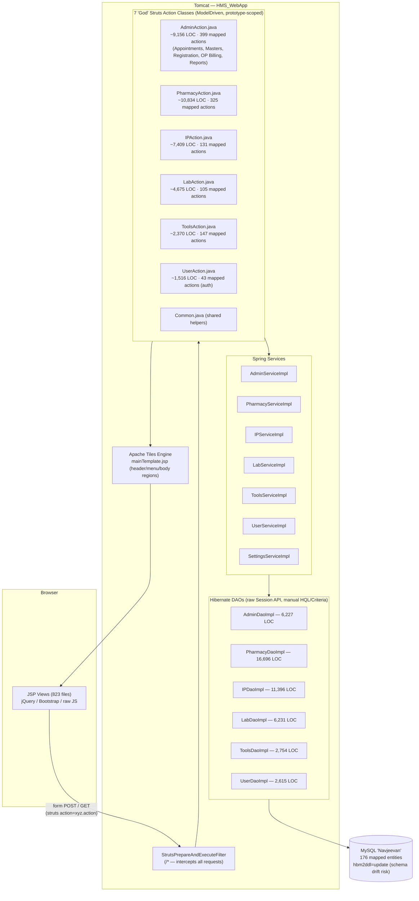
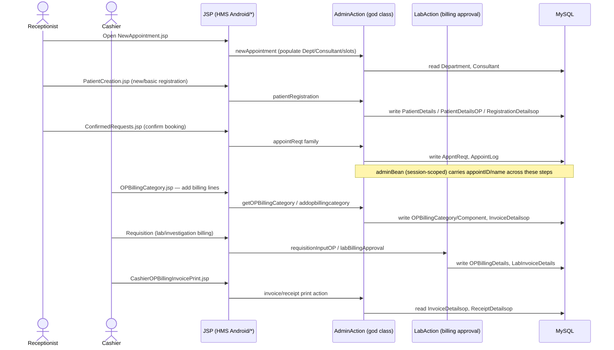
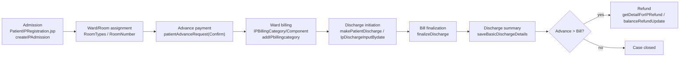
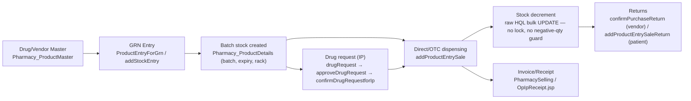
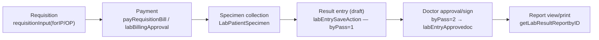
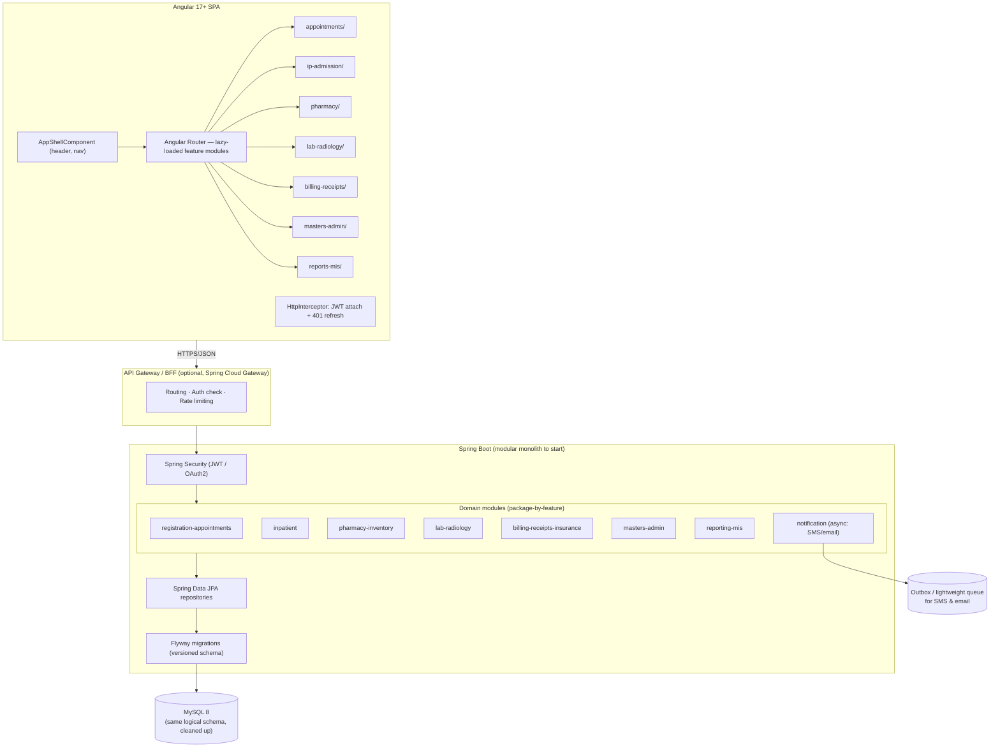
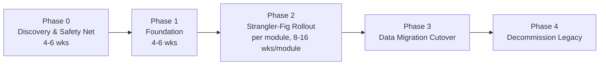

# Navjeevan HMS — Legacy Struts Modernization Blueprint

**From:** Struts2 + Spring 3 + Hibernate 3 + JSP/Tiles monolith (`com.pms`)
**To:** Angular SPA + Spring Boot REST microservices/modulith + MySQL
**Prepared:** 2026-07-09

> Scope note: this system has **1,225 Struts action mappings**, **823 JSPs**, **176 Hibernate entities**, and **~152,000 lines of Java** concentrated in 7 "god" action/DAO classes. Exhaustively documenting every screen is not tractable in prose — this document gives complete *quantitative* inventories (counts, generated CSV catalogs) plus *representative, end-to-end traced* workflows per module, which is what an architect actually needs to plan and execute the migration safely.

---

## 1. System Identity

| | |
|---|---|
| Product | Navjeevan HMS (Hospital / Patient Management System) — package `com.pms`, deployed as `HMS_WebApp` |
| Presentation | JSP 823 files + Apache Tiles 2 (`tiles-def.xml`, 627 definitions) + jQuery/Bootstrap |
| Controller layer | Struts 2.0 (`StrutsPrepareAndExecuteFilter`), **1,225 actions**, `struts.enable.DynamicMethodInvocation=false`, `ModelDriven` actions |
| DI / Service layer | Spring 3.x (`ContextLoaderListener`, `component-scan base-package="com.pms"`) |
| Persistence | Hibernate 3 (`AnnotationSessionFactoryBean`, **176 `@Entity`** classes, `hibernate.hbm2ddl.auto=update`) |
| Connection pool | HikariCP (`maximumPoolSize=100`) |
| Database | MySQL 5.x (`com.mysql.jdbc.Driver`, schema `Navjeevan`) |
| Session | HttpSession, **`session-timeout = -1` (infinite, never expires)** |
| Auth | Custom, in `UserAction` / `UserDaoImpl` (no Spring Security) |
| Notifications | `AutoMailGenerator`, `SendSMS` (SMTP + SMS gateway) |
| Reporting/export | `ExcelUpload`, `CategoryExcelImport` (Apache POI), image handling via `ImageCompress` |

---

## 2. As-Is Component Architecture



**Key structural facts (from static analysis):**

- Struts.xml (**4,955 lines**) maps **1,225** `<action>` entries to only **7** Java classes via the `method=` attribute — a classic "God Action" anti-pattern. `PharmacyAction`/`PharmacyDaoImpl` alone are ~10.8K/16.7K lines.
- **~71 actions** (`class="appoint"`, `class="hrms"`, `class="billing"`) reference Spring bean ids that **do not exist** anywhere in the current source or `applicationContext.xml` — these are dead/broken routes (would throw `NoSuchBeanDefinitionException` if hit). Treat as orphaned legacy config; confirm with SMEs before excluding from scope.
- Presentation uses **Tiles composition**, not per-page templates: one `mainTemplate.jsp` (header + menu + body regions) with 627 "definitions" that swap only the `body` attribute — this is structurally very close to an Angular **shell component + router-outlet**, which simplifies the UI migration.
- The `WebRoot/HMS Android` folder (despite its name) holds **535 of the ~1,050 resolvable body JSPs** — it is not a mobile app, just a (confusingly named) folder holding most master/admin/appointment screens.
- No `.hbm.xml` mapping files exist — all 176 entities are annotation-mapped (`@Entity`/`@Table`/`@Id`) and registered explicitly in `applicationContext.xml`'s `<list>` of `annotatedClasses`.

---

## 3. Module Inventory (by action volume and JSP folder)

| Module (WebRoot folder) | Action-class owner | Struts actions routed | Representative entities |
|---|---|---|---|
| Appointments / Registration / Reports/MIS | `AdminAction` (`admin`) | 399 | `PatientDetails`, `PatientDetailsOP`, `AppntReqt`, `AppointLog`, `Consultant`, `Department`, `CommonMaster` |
| Pharmacy (incl. Inventory, POModule, Equipment, GRN) | `PharmacyAction` (`pharmacy`) | 325 | `Pharmacy_ProductMaster`, `Inventry_*`, `PharmacySelling`, `Prescription`, `FA_*` (fixed assets) |
| Tools / cross-cutting utilities | `ToolsAction` (`tool`) | 147 | misc lookups, exports |
| In-Patient (IP) + Billing Module | `IPAction` (`ip`) | 131 | `InpatientDetails`, `IPBillingDetails`, `RoomTypes`, `AdvancePayments`, `BasicDischargeSummary` |
| Lab + Radiology (CTScan/Xray) | `LabAction` (`lab`) | 105 | `Requisition`, `LabTestResult`, `LabPatientSpecimen` |
| Auth / User / Session | `UserAction` (`user`) | 43 | `Userdetails`, `RoleMaster`, `Roles` |
| **Orphaned/dead** (`appoint`, `hrms`, `billing` — no backing bean) | — | 71 | n/a — **migration risk, needs SME triage** |

Full machine-generated catalog (action name → class.method → result → resolved JSP) has been extracted for engineering use — see §7 Appendix.

---

## 4. As-Is Module Workflows (traced end-to-end)

> **Critical scoping finding, confirmed across all three research passes:** a meaningful fraction of this codebase is **dead or orphaned** — present in the source tree but unreachable via `struts.xml`/`tiles-def.xml`. Do not use folder/file names as a proxy for "this is a live feature." Verified dead-or-orphaned items:
>
> | Item | Evidence |
> |---|---|
> | Most of `WebRoot/Appointments/*.jsp` (the numbered `0X_*.jsp` wizard, `AppointConfirm`, `AppointmentDashBoard`, `AppointmentReschedule`, `AppointmentCancelInput`, `AppointmentDiscount*`, `AppointmentRefundInd`) | Never referenced as a tile body anywhere; the **live** booking/registration/reschedule/cancel/discount/refund screens are under `WebRoot/HMS Android/*.jsp` instead, routed through the same `AdminAction`/`UserAction` classes |
> | `AdminAction.newAppointmentaction` | The real `adminService.newAppointment(...)` call is **commented out**; method just returns a canned success message — actual booking happens through a different action family (`appointReqt`) |
> | Entire `WebRoot/CTScan` folder | Form actions these JSPs post to don't exist in `struts.xml`; no `tiles-def.xml` entry references `/CTScan/*`. The live CT/Xray invoice screens are `Receipts/CashierLabCTScanInvoicePrint.jsp` / `CashierLabXrayInvoicePrint.jsp` (no `WebRoot/Xray` folder even exists) |
> | Entire `WebRoot/Waste` folder | Byte-identical duplicate of 3 files already in `WebRoot/Reports`; referenced by no action or tiles-def entry. Despite the name, **there is no biomedical-waste-tracking feature in this codebase** |
> | `LoginAction1` / `com.pms.action.UserAction1` | Declared in `struts.xml` line 81; `UserAction1.java` does not exist anywhere in source, build output, or the deployed copy — hitting this route throws a Spring bean-resolution error |
> | ~71 actions on `appoint`/`hrms`/`billing` beans (§2) | No matching Spring bean anywhere |
> | Duplicate `<action>` definitions with identical names (e.g. `showCollectionReport`, `addEquipmentAccetcategory` each defined twice) | Confirmed via direct grep — Struts silently uses the last definition; the other is dead config |
> | `getBasicDischargeSummaryInput_old.jsp`, `InventoryReport_old.jsp`, ~10 near-duplicate appointment-cancel methods in `AdminAction`, a commented-out duplicate of `addProductEntrySaleReturn` in Pharmacy | Superseded/duplicate logic left in place |
>
> **Recommendation:** confirm each of these against production access logs (if available) before excluding from migration scope, but plan for materially less real surface area than the raw 1,225-action / 823-JSP count suggests.

### 4.1 Outpatient: Registration → Appointment → OP Billing → Receipt



| JSP (live) | Struts action | Java class.method | Entities | Notes |
|---|---|---|---|---|
| HMS Android/NewAppointment.jsp | `newAppointment` | `AdminAction.newAppointment` | Department, Consultant | Dropdown population only |
| HMS Android/PatientCreation.jsp | `patientRegistration` | `AdminAction.patientRegistration` | PatientDetails, PatientDetailsOP, RegistrationDetailsop | Real registration entry point |
| HMS Android/ConfirmedRequests.jsp | `confirmreq` family | `AdminAction.*` | AppntReqt, AppointLog | `adminBean` session state across steps |
| Cancel flow (~10 near-duplicate methods) | `cancelAppnt`,`reqCancelApp`,`reqCancelApp1`,`reqCancelPat*`,`Advancecancel`,`canceladmision` | `AdminAction.*` | AppntReqt, AppointLog, PatientDetailsOP | Unclear which are truly reachable — needs SME triage |
| OPBilling/OPBillingCategory.jsp | `getOPBillingCategory`,`addopbillingcategory` | `AdminAction.*` (via `userService`) | OPBillingCategory/Component | Billing-category logic lives in AdminAction, not a dedicated Billing controller |
| OPBilling/RequisitionInput*.jsp | `requisitionInputOP`,`requisitionInputOne` | **`LabAction`** (cross-module) | OPBillingDetails, LabInvoiceDetails | Investigation billing routed through Lab, not Admin |
| HMS Android/RefundApprovalDetails.jsp | `refundApproval` | `AdminAction.refundApproval` | InvoiceDetails, AppntReqt | `updateRecepitDetailsForRefund` call is **commented out** — likely bug: receipt table not updated on refund |
| Receipts/CashierOPBillingInvoicePrint.jsp | invoice/print action | `AdminAction.*` | InvoiceDetailsop, ReceiptDetailsop | One of several near-duplicate print JSPs per department (OP/Lab/CTScan/IP each have their own copy instead of one generic print view) |

**Business rules/quirks worth preserving deliberately (not accidentally) in the rewrite:** duplicate-check before booking (`commonExistCheck`), `ipService.billingLog(...)`/`adminService.notification(...)` audit+SMS hook fired after every billing mutation, discount/refund requiring an approval step before the ledger updates.

### 4.2 In-Patient: Admission → Ward Billing → Discharge → Refund



| JSP | Struts action | Java class.method | Entities | Notes/quirks |
|---|---|---|---|---|
| PatientIPRegistration.jsp | `createIPAdmission` | `IPAction.createIPAdmission` | PatientRegistration, InpatientDetails | **Hardcoded local filesystem path** (`C:\HealthySoft\HMS\Patient\<nfid>\...`) for photo upload — breaks on any non-identical server/cloud deploy |
| IPBillingCategory.jsp / Component.jsp | `getIPBillingCategory`,`addIPbillingcategory`,`addipbillingcomponent` | `IPAction.*` | IPBillingCategory/Component/Details | Category→component hierarchy edited live per admission |
| Patient advance screens | `patientAdvanceRequest(Confirm)`,`addPatientAdvanceWallet` | `IPAction.*` | AdvancePayments, CashierHistory | `ipID` stashed in `HttpSession` — cross-request coupling |
| IPDischarge*.jsp | `makePatientDischarge`,`IpDischargeInputBydate`,`finalizeDischarge` | `IPAction.*` → `IPDaoImpl.finalizeDischarge/patientDischarge` | InpatientDetails, RoomNumber, InpatientBilling | **`finalizeDischarge` runs raw string-concatenated HQL bulk updates — SQL/HQL-injection risk, no parameter binding**; discharge-ID via `select max(...)` with no lock (race condition under concurrency) |
| getBasicDischargeSummaryInput.jsp | `saveBasicDischargeDetails`,`addDrugForBasicDischarge` | `IPAction.*` | BasicDischargeSummary, IPPrescription | Dead duplicate `_old.jsp` kept alongside |
| CashierIPApproval/InvoiceDetail | `getDetailForIPRefund`,`balanceRefundUpdate` | `IPAction.*` | RefundDetails, CashierHistory | No visible double-approval control on refund amount |

`IPAction`/`IPDaoImpl` mix admission, billing, discharge, and insurance in one file each (7.4K / 11.4K lines) — plan to decompose into ~6 bounded contexts (Admission, Ward-Billing, Discharge, Advance/Wallet, Refund, Insurance).

### 4.3 Pharmacy: Master → Procurement (GRN) → Dispensing → Sales/Returns



| JSP | Struts action | Java class.method | Entities | Notes/quirks |
|---|---|---|---|---|
| GRNEntry.jsp | `ProductEntryForGrn`,`addStockEntry`,`saveGrnStatus` | `PharmacyAction.*` | Inventry_PurchaseGrn, Pharmacy_ProductDetails | Batch/expiry per GRN line; status is an untyped int code, no workflow state machine |
| DrugRequestFromNurse.jsp | `drugRequest`,`approveDrugRequest`,`confirmDrugRequestforIp` | `PharmacyAction.*` | Prescription/IPPrescription | Two-step approve→confirm; hardcoded status literal `1` |
| AddDrugsByNF.jsp | `addProductEntrySale` | `PharmacyAction.addProductEntrySale` → `PharmacyDaoImpl.addPharmacySaleComponents` | pharmacySellingDetails, Pharmacy_ProductDetails | **Stock decrement is a raw HQL bulk update with no negative-stock guard or row lock — real overselling race condition under concurrent dispensing**; `locationId` hardcoded to `2`; `System.out.println` debug logging left in |
| PurchaseReturn.jsp | `confirmPurchaseReturn`,`addProductEntrySaleReturn` | `PharmacyAction.*` | Inventry_PurchaseGrn, pharmacySellingDetails | A large commented-out duplicate of `addProductEntrySaleReturn` sits earlier in the same file — dead code |
| ExpireReport/FastMoving/NonMoving.jsp | report actions | `PharmacyAction.*`/`PharmacyDaoImpl` | Pharmacy_ProductDetails | Built by iterating in Java; no server report engine |

`PharmacyAction` (10.8K LOC) / `PharmacyDaoImpl` (**16.7K LOC — the largest file in the repo**) is the highest-effort module to migrate; budget accordingly and prioritize the stock-decrement concurrency fix (add `@Version` optimistic locking) as a correctness requirement, not a nice-to-have.

### 4.4 Lab & Radiology: Requisition → Specimen → Result → Approval → Billing



| JSP | Struts action | Java class.method | Entities | Notes/quirks |
|---|---|---|---|---|
| Lab/LabPatientDetails.jsp | `requisitionInput`,`requisitionInputforIP`,`requisitionInputOP` | `LabAction.*` | Requisition, RequisitionDetails | Same underlying method (`requisitionInputOne`) serves 3 differently-named actions |
| (billing) | `payRequisitionBill`,`labBillingApproval`,`OPBillingApproval*` (3 action names) | `LabAction.labBillingApproval` | LabInvoiceDetails | One method, three routes, differentiated only by result tile — collapse to one parameterized endpoint in the rewrite |
| labEntrySaveAction | `labEntrySaveAction` | `LabAction.labResultSave` | LabTestResult, LabPatientSpecimen | **Approval state is a raw int flag (`byPass`: 1=save, 2=approve), not a named enum**; doctor name parsed via fragile `split("-")[0]` |
| viewFileUpload | `viewFileUpload` | `LabAction.viewFileUpload` | — | Method body is a no-op stub — incomplete/dead feature, `ImageCompress` is not actually wired into Lab despite being available |

CT-Scan and Xray are **not separate code paths** — they're a `LabCategory` master-data variant of this same generic flow; do not build separate Angular modules for them, and do not port the dead `WebRoot/CTScan` JSPs.

### 4.5 Insurance (owned by IPAction, not AdminAction)

| JSP | Struts action | Java class.method | Entities | Notes/quirks |
|---|---|---|---|---|
| Insurance/InsurancePatientList.jsp | `inPatientInsuranceList` | `IPAction.getInnPatientInsuranceListSummary` | InsuranceDetails | Owned by IP module, contrary to the "Insurance is its own module" assumption |
| (raise request) | `risePreAuthorization`,`riseEnhancement` | `IPAction.*` → `IPDaoImpl.preAuthorizationRequest` | InsuranceDetails | Status distinguished by hardcoded strings, not an enum |
| InsuranceApproval.jsp | `insuranceApprove`,`insuranceCancel` | `IPAction.*` → **`IPDaoImpl.updateApprovalDetails`** | InsuranceDetails | **Confirmed string-concatenated HQL** (`"...insStatus='"+approval+"'... where id="+id`) — direct injection risk; also a `String == ` reference-equality bug (`type=="Enhancement"`) |
| ClaimReport.jsp | `getClaimReport` | `IPAction.getClaimReport` | InsuranceDetails, InsuranceLTD | Totals aggregated in a **Java loop over the full result set**, not SQL `SUM()` — will not scale |
| InsuranceCancelReport.jsp | `getCancelReportByDate` | `IPAction.*` → `IPDaoImpl.getInsuranceDetailsByDate` | InsuranceDetails | Another string-built native query |

### 4.6 Auth, Master Data, Settings, Reports (see also §9 Risk Register)

- **Auth**: `UserAction.login` → `UserDaoImpl.makeAuthentication` builds its HQL via **raw string concatenation of username/password with no hashing anywhere** — this is both a plaintext-password and an injection finding, and is the single highest-priority item to fix regardless of migration timeline. Authorization is enforced only by ad hoc `session.getAttribute("role")` string comparisons scattered in JSP menu scriptlets — a direct request to an action bypasses any menu-hiding.
- **Master data**: the add/edit/deactivate (soft-delete) CRUD shape is duplicated near-identically across Departments, Consultants, Roles/Users, Lab categories, IP billing categories, HRMS categories, and Equipment categories (4-5 independent copies of the same pattern) — the single highest-leverage simplification available in the rewrite (§5).
- **Settings**: almost entirely bulk Excel-upload screens (10+ near-identical variants) funneling into `ExcelUpload`/`CategoryExcelImport` (Apache POI); appointment slot-timing rules are **hardcoded in `UserAction.getAppointment()`** rather than being admin-configurable, despite `SessionTimings` existing as an entity with no CRUD screen.
- **Reports/MIS**: no server-side reporting engine (no JasperReports/iText) — "export" is 100% client-side (`jsPDF`/`html2canvas`/`table2excel` screenshotting the rendered table), which has real fidelity/pagination limits worth fixing in the rewrite rather than reproducing.

---

## 5. Struts → Angular / Spring Boot Mapping Strategy

Because 1,225 actions collapse to 7 classes and 1,050 JSPs collapse to a few recurring **UI patterns**, the mapping is done at the *pattern* level, not action-by-action:

| As-Is Pattern | Instance count (approx.) | Target Angular | Target Spring Boot |
|---|---|---|---|
| Tiles "definition" swapping only `body` inside `mainTemplate.jsp` | 627 definitions | Single `AppShellComponent` (header+menu) + `<router-outlet>`; each definition → one lazy-loaded **feature route** | N/A (pure routing concern) |
| Master/detail CRUD (`CommonMaster`, `Department`, `Consultant`, category-subcategory-component triads) | dozens of near-identical action pairs (`getX` / `addX` / `xEdit` / `xUpdate` / `xDeactivate`) | One generic `MasterCrudComponent<T>` (table + reactive form), configured per entity via a metadata map | One generic `MasterController<T>` + `MasterService<T>` using a repository-per-entity strategy (Spring Data JPA `JpaRepository<T,ID>`), or per-domain controllers exposing standard verbs |
| Multi-step wizard (registration → appointment → confirm, admission → billing → discharge) | Appointments (`0X_*.jsp` sequence), IP admission/discharge | Angular **stepper/wizard component** with a route-guarded multi-step form, one reactive form group per step | One REST resource per step's data (`POST /api/appointments/draft`, `PATCH .../{id}/confirm`, etc.) instead of session-scoped `ModelDriven` beans |
| Session-scoped `ModelDriven` bean carrying state across requests (`AdminBean`, `IPBean`, `PharmacyBean`, `ToolsBean`, `UserBean`, `LabBean` — all Spring **prototype**-scoped, populated by Struts params interceptor) | 6 beans backing all 1,225 actions | Angular component/service-local state (RxJS `BehaviorSubject` or NgRx store slice per feature) | Stateless REST controllers — each call carries its own payload/DTO; no server-side conversational state (biggest architectural shift — see Risk R2) |
| Direct Hibernate `Session`/`Criteria`/HQL string-building inside DAOs | 17 DAO impl classes, manual `sessionFactory.getCurrentSession()` | — | Spring Data JPA repositories + `@Transactional` services; replace hand-rolled HQL with Query Methods / `@Query` / Criteria API (JPA) |
| Excel import/export (`ExcelUpload`, `CategoryExcelImport`) | Pharmacy/Masters bulk upload screens | Angular file-upload component + client-side preview grid | Spring Boot endpoint using Apache POI (reuse existing parsing logic), return job status |
| SMS/Email triggers (`SendSMS`, `AutoMailGenerator`) embedded inside action methods | scattered across appointment confirm/cancel, billing | — | Extract to a `NotificationService` (Spring `@Async` + a queue/outbox table) so it's decoupled from the request thread and independently retryable |
| Auth via custom session check in every action | 43 `user`-class actions + ad hoc checks elsewhere | Angular route guards + `HttpInterceptor` attaching JWT | Spring Security + JWT/OAuth2 resource server; replace `session-timeout=-1` with a real, configurable expiry |

### Concrete example (Appointment booking — illustrative row from §7 catalog)

| Struts action | Class.method | Tiles/JSP | → Angular route/component | → Spring Boot endpoint |
|---|---|---|---|---|
| `getDepartments` | `admin.getDepartmentDetails` | `department` → `/HMS Android/Department.jsp` | `/masters/departments` → `DepartmentListComponent` | `GET /api/masters/departments` |
| `addDepartment` | `admin.addDepartment` | `department` (same view, re-rendered) | same route, `DepartmentFormComponent` (dialog/inline) | `POST /api/masters/departments` |
| `deptEdit` / `updateDept` | `admin.deptEditDetails` / `deptUpdateDetails` | `department` | same component, edit mode | `GET /api/masters/departments/{id}`, `PUT /api/masters/departments/{id}` |
| `deptDeactivate` | `admin.deptDeactivateDetails` | `deactivateSuc` | optimistic UI toast, no route change | `PATCH /api/masters/departments/{id}/deactivate` |

This 4-action-to-1-resource collapse repeats for **every master entity** (consultants, drug categories, lab categories, billing categories, room types, etc.) — expect roughly **150-200 REST endpoints** total after collapsing the CRUD quadruplets, versus 1,225 raw Struts actions.

---

## 6. Target Architecture



**Design choices and why:**

1. **Modular monolith first, not microservices.** 176 entities are heavily cross-referenced (billing touches patient, appointment, pharmacy, lab, insurance). Splitting into separately-deployed microservices before the domain boundaries are proven would recreate the current god-object coupling as *distributed* coupling — worse. Start with package-by-feature modules inside one Spring Boot deployable; only extract a service (e.g. Notifications, Reporting) once it has a stable, narrow contract.
2. **Stateless REST + JWT**, replacing the `-1` (infinite) HTTP session and the 6 prototype-scoped `ModelDriven` beans that currently carry request state. This is the single biggest behavioral change and must be called out to QA (see Risk R2).
3. **Flyway-managed schema**, replacing `hibernate.hbm2ddl.auto=update`. The current setting lets Hibernate silently alter production schema on deploy — acceptable for a dev sandbox, unacceptable once this is under real migration control.
4. **Spring Data JPA repositories** replace the hand-written `SessionFactory`/`Criteria`/HQL string-concatenation DAOs (some of which — `PharmacyDaoImpl` at 16.7K lines — almost certainly contain duplicated query logic that a repository + specification pattern will collapse dramatically).
5. **MySQL retained** (already MySQL in prod, per `database.properties` — this is a lift, not a database migration in the RDBMS-engine sense, but see §6.3 for schema cleanup needed).

### 6.1 Angular frontend structure

```
hms-web/
  src/app/
    core/            # auth guard, http interceptor, error handling
    shared/          # generic MasterCrudComponent<T>, wizard/stepper base, pipes
    features/
      appointments/
      registration/
      ip-admission/
      pharmacy/
      lab-radiology/
      billing-receipts/
      insurance/
      masters-admin/
      reports-mis/
    layout/          # AppShellComponent, header, side-nav (replaces mainTemplate.jsp/header.jsp/menu.jsp)
```

The concrete design system implementing this structure (design tokens, Material
theming, the shared component library including `MasterCrudComponent<T>`, and
the page templates each feature screen should follow) is documented in
[UI-UX-Design-System.md](./UI-UX-Design-System.md).

### 6.2 Spring Boot backend structure

```
hms-api/
  src/main/java/com/pms/
    config/            # SecurityConfig, CORS, OpenAPI
    common/            # shared DTOs, exception handling, audit
    registration/       {controller, service, repository, entity, dto}
    ipadmission/
    pharmacy/
    labradiology/
    billing/
    masters/
    reporting/
    notification/       # async SMS/email, replacing SendSMS/AutoMailGenerator call sites
  src/main/resources/
    db/migration/        # Flyway V1__baseline.sql (reverse-engineered from current 176 entities), V2__..., etc.
```

### 6.3 Database changes needed (not a new schema — a cleanup pass)

- Reverse-engineer a Flyway `V1__baseline.sql` from the **current live schema** (source of truth, since `hbm2ddl.auto=update` means the entities and the schema can drift) — do this with a schema-diff tool against the actual `Navjeevan` database, not just by reading `@Entity` annotations.
- Add missing foreign keys / indices — a 176-entity Hibernate-managed schema built via `hbm2ddl=update` over years commonly accumulates orphaned or inconsistent constraints; audit before Flyway-baselining.
- Preserve MySQL as the engine (no engine migration risk), but plan a **MySQL 5.x → 8.x** upgrade alongside the app migration (driver in use is `com.mysql.jdbc.Driver`, the pre-8 legacy driver).
- Rotate/externalize DB credentials — `database.properties` currently stores a **plaintext password committed alongside source**; move to environment variables / a secrets manager before this codebase (or the doc) goes anywhere near a shared repo.

---

## 7. Step-by-Step Migration Plan



### Phase 0 — Discovery & Safety Net (4-6 weeks)
1. **Freeze schema drift**: set `hibernate.hbm2ddl.auto=validate` (not `update`) in a staging environment immediately, and snapshot the live schema with a diff tool — stop silent schema mutation before anything else happens.
2. **Characterization tests**: since business logic is buried inside 9K-17K-line God classes with no existing test suite (none found in the repo), write black-box tests against the *running legacy app* (HTTP-level, via the 1,225 action catalog) for the highest-traffic journeys (registration, appointment booking, OP billing, IP billing/discharge, pharmacy dispensing) before touching any code. These become the regression oracle for the new Spring Boot endpoints.
3. **Resolve the 71 orphaned actions** (`appoint`/`hrms`/`billing` beans) with the business owner: dead code to delete, or a broken feature to restore? This blocks accurate scoping of Phase 2.
4. **Confirm the true production schema** (not just the 176 `@Entity` classes) — export DDL from the live MySQL `Navjeevan` database as the Flyway baseline source of truth.

### Phase 1 — Foundation (4-6 weeks, parallel to Phase 0 tail)
1. Stand up `hms-api` (Spring Boot 3.x, Java 17+) and `hms-web` (Angular 17+) skeletons at `D:\project\Navjeevan\HMS` per §6.1/6.2.
2. Implement Spring Security + JWT auth, porting the logic in `UserAction`/`UserDaoImpl` (43 actions) — this unblocks every other module since every screen depends on session/auth today.
3. Stand up Flyway with the Phase-0 baseline DDL; wire `AppShellComponent` (header/menu) and the routing skeleton.
4. Build the two shared primitives everything else reuses: generic `MasterCrudComponent<T>` (Angular) and a generic master-entity REST pattern (Spring) — this is what pays off across the dozens of near-identical category/subcategory/component CRUD screens.

### Phase 2 — Strangler-Fig Module Rollout (8-16 weeks per module, can parallelize across teams)
Recommended order, by (a) how self-contained the module is and (b) business risk of getting it wrong:

| Order | Module | Why this position |
|---|---|---|
| 1 | Masters/Admin (departments, consultants, common master) | Lowest risk, exercises the shared CRUD primitives, needed by every other module |
| 2 | Appointments/Registration | High visibility, moderate complexity, validates the wizard/stepper pattern |
| 3 | OP Billing/Receipts | Financial correctness-critical — needs the characterization tests from Phase 0 |
| 4 | Lab/Radiology | Contained domain, some file-upload/image handling to port (`ImageCompress`) |
| 5 | Pharmacy/Inventory | Largest single God class (16.7K-line DAO) — budget the most time, expect hidden business rules in stock/batch logic |
| 6 | IP (in-patient) + Billing Module | Most cross-module dependency (touches billing, pharmacy, insurance) — do last so its dependents already exist on the new stack |
| 7 | Insurance, MIS/Reports, Waste, Settings | Lower volume, can trail or run opportunistically alongside others |

Within each module: stand up the new Angular feature + Spring Boot module behind a **routing rule at the reverse proxy** (legacy Struts app stays live for un-migrated modules, path-based routing sends migrated module traffic to the new stack — classic strangler fig). Run legacy and new in parallel with a feature flag per user/role for staged rollout, not a big-bang cutover.

### Phase 3 — Data Migration Cutover
1. Because both old and new run against the **same MySQL schema** during Phase 2 (no ETL needed module-by-module — it's the same database), the only true "data migration" event is the Flyway schema cleanup itself (constraint additions, MySQL 8 upgrade). Do this in a maintenance window with a tested rollback script.
2. Reconcile any Hibernate-implicit columns/tables that `hbm2ddl.auto=update` created but that aren't reflected in any entity anymore (drift artifacts found in Phase 0) — decide keep/drop per table with the business owner.
3. Run the Phase-0 characterization test suite against the fully-migrated stack before decommissioning legacy.

### Phase 4 — Decommission Legacy
Remove Struts filter, Tiles, JSPs, and the 7 God classes only after the last module's traffic has been on the new stack with zero rollback for an agreed bake period (recommend 2-4 weeks per module, sign-off from the module's business owner).

---

## 8. Risk Register

| ID | Risk | Impact | Mitigation |
|---|---|---|---|
| R1 | **God classes** (`PharmacyDaoImpl` 16.7K, `IPDaoImpl` 11.4K, `PharmacyAction` 10.8K, `AdminAction` 9.2K lines) hide undocumented business rules with no existing tests | High — silent behavior loss during rewrite | Characterization tests (Phase 0) before any line of business logic is rewritten, not just typed-through |
| R2 | Session-scoped `ModelDriven` beans (`AdminBean`, `IPBean`, `PharmacyBean`, etc.) carry state across a multi-request wizard; stateless REST removes that implicit state | Medium-High — multi-step flows (registration→appointment, admission→discharge) may silently break if state isn't explicitly threaded through the new API | Explicitly model each wizard's state as a DTO returned to and re-submitted by the client; do not assume a 1:1 request mapping |
| R3 | `hibernate.hbm2ddl.auto=update` means the live schema may not match any single source of truth | High — Flyway baseline could be built from stale entity annotations instead of reality | Export live DDL directly from MySQL as baseline, diff against entities, resolve discrepancies with DBA/business sign-off |
| R4 | 71 Struts actions reference non-existent Spring beans (dead/broken routes) | Low-Medium — could represent a **removed feature users still navigate to and silently fail**, or truly dead config | SME triage in Phase 0; do not assume "orphaned" == "safe to ignore" without checking access logs if available |
| R5 | Infinite session timeout (`session-timeout=-1`) + plaintext DB password in `database.properties` | High (security) | Fix independent of the migration timeline — this is a live production security gap today, not just a modernization nicety |
| R6 | Reporting/Excel export logic (`ExcelUpload`, `CategoryExcelImport`, POI-based) is tightly coupled to current DAOs | Medium | Extract as a standalone service early; reuse parsing logic, don't rewrite from scratch |
| R7 | No automated tests found anywhere in the current codebase | High — regressions are the top migration failure mode for this class of project | Non-negotiable: Phase 0 characterization tests are the actual project insurance policy |
| R8 | 823 JSPs likely contain embedded scriptlet business logic (needs confirming per-module; see §4 findings) beyond what the Java action/DAO layer shows | Medium-High | Treat JSP scriptlets as a first-class source of business rules during each module's Phase 2 discovery, not just the Java layer |
| R9 | **Confirmed HQL/SQL injection via string concatenation** in `UserDaoImpl.makeAuthentication` (login query), `IPDaoImpl.finalizeDischarge`/`patientDischarge`, `IPDaoImpl.updateApprovalDetails` (Insurance), `IPDaoImpl.getInsuranceDetailsByDate` — user input concatenated directly into HQL/native queries with no parameter binding | **Critical (security)** — this is exploitable in the *current live system*, not just a migration concern | Treat as a P0 production security fix independent of the migration timeline; parameterize immediately in the legacy code if it will run any longer, and use Spring Data JPA/Criteria exclusively (no string-built queries) in the rewrite |
| R10 | Pharmacy stock decrement (`PharmacyDaoImpl.addPharmacySaleComponents`) is a raw HQL bulk `UPDATE` with no negative-quantity guard, row lock, or optimistic version check | High — concurrent dispensing can oversell/double-sell stock | Add `@Version` optimistic locking + a DB-level `CHECK (qty >= 0)` constraint when this becomes a JPA entity; do not port the bulk-update pattern as-is |
| R11 | Significant dead/orphaned code confirmed in-tree: most of `WebRoot/Appointments`, all of `WebRoot/CTScan`, all of `WebRoot/Waste`, `LoginAction1`/`UserAction1` (missing class), duplicate `<action>` definitions, ~10 near-duplicate cancel methods, several commented-out duplicate methods | Medium — risk of **wasting migration effort porting screens nobody uses**, or conversely **missing a feature that's actually reachable through an undiscovered path** | Confirm liveness against production access logs/analytics before finalizing the Phase 2 module scope; treat §4's dead-code findings as a hypothesis to verify, not a final answer |
| R12 | Billing/reporting logic is scattered unpredictably across action-class boundaries — e.g. OP investigation billing lives in `LabAction` not `AdminAction`; Insurance lives in `IPAction` not a dedicated module; insurance claim totals are summed in a Java loop instead of SQL `SUM()` | Medium — naive 1:1 "port `AdminAction` to `AdminController`" mapping will misplace functionality and miss performance issues | Design REST controller boundaries from the *DAO/domain* seams identified in §4, not from the current action-class names; re-check every aggregate/report calculation for N+1 or in-memory-summation patterns before porting |

---

## 9. Appendix — Generated Artifacts

Two CSV files were generated by parsing `resources/struts.xml` and `WebRoot/WEB-INF/tiles-def.xml` directly (not hand-transcribed, so they are authoritative for the current codebase):

- `struts_actions.csv` — every `<action>`: name, class, method, result name/type/value (1,225 actions / 1,355 result rows)
- `struts_actions_resolved.csv` — same, with Tiles definitions resolved to their final JSP body path (1,050 of 1,204 tiles-typed results resolved; 87 definition names didn't resolve to a `body` attribute — likely inherited-only or malformed definitions, worth a lint pass)

Use these as the seed for the Angular route table and Spring Boot controller/endpoint list — every row is a candidate REST endpoint + component.
